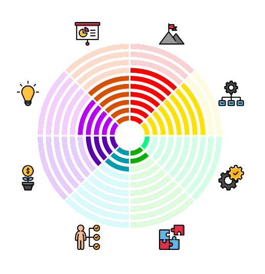

# react-native-arc-chart-view

Arc chart component built for react native based on [ArcChartView](https://github.com/imaNNeo/ArcChartView)



## Installation (Expo only)

```sh
yarn add react-native-arc-chart-view
```

```sh
npx expo prebuild
```

## Usage

```tsx
import { ReactNativeArcChartView } from "react-native-arc-chart-view";

<ReactNativeArcChartView
  sectionsCount={6}
  iconSize={60}
  sectionsSpace={5}
  linesCount={10}
  midStartExtraOffset={10}
  sectionsIcons={images}
  onFinishedSettingSectionValue={({
    nativeEvent: { sectionPos, sectionValue },
  }) => {
    console.log(sectionPos, sectionValue);
  }}
/>;
```

## Props

|           Attribute           |                   Type                    |                                Description                                 |
| :---------------------------: | :---------------------------------------: | :------------------------------------------------------------------------: |
|          linesCount           |                  number                   |       lines count of chart (i mean arc lines), default value is `10`       |
|          linesSpace           |                  number                   |             lines space (lines margin), default value is `4dp`             |
|          linesWidth           |                  number                   |                    lines width , default value is `6dp`                    |
|         sectionsCount         |                  number                   |                   sections count , default value is `8`                    |
|         sectionsSpace         |                  number                   |         sections space (sections margin) , default value is `4dp`          |
|      midStartExtraOffset      |                  number                   |             center extra offest size, default value is `16dp`              |
|           iconSize            |                  number                   |                  the icons size, default value is `32dp`                   |
|         sectionsIcons         |                 string[]                  |                 array of the icons for the chart sections                  |
|        sectionsValues         |                 number[]                  |                 array of the values for the chart sections                 |
|  onStartSettingSectionValue   | {sectionPos: number, sectionValue:number} | a callback to get the value of the changing section on start of the action |
| onContinueSettingSectionValue | {sectionPos: number, sectionValue:number} |     a callback to get the value of the changing section on drag action     |
| onFinishedSettingSectionValue | {sectionPos: number, sectionValue:number} |       a callback to get the value of the changing section on finish        |

## TODO

- [x] Android support
- [ ] iOS support
- [ ] Web support
